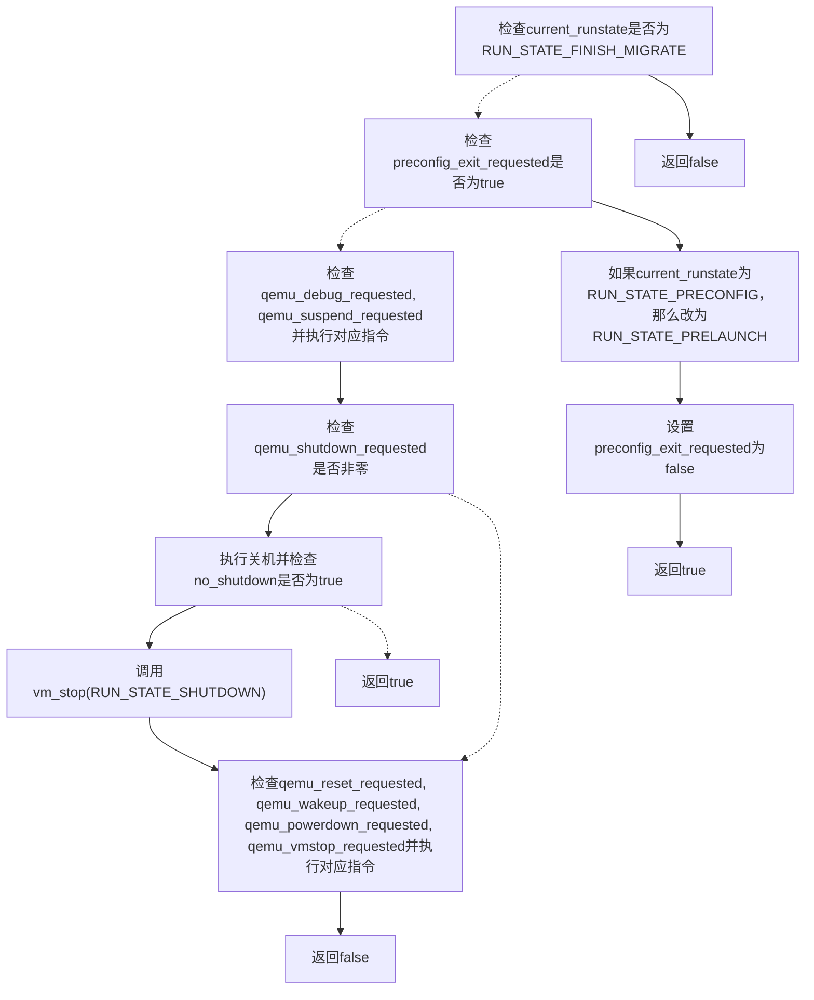

```mermaid
graph TB;
	cfm[检查current_runstate是否为RUN_STATE_FINISH_MIGRATE]
	cpertrue[检查preconfig_exit_requested是否为true]
	cqsr[检查qemu_shutdown_requested是否非零]
	crest["检查qemu_reset_requested, qemu_wakeup_requested, qemu_powerdown_requested, qemu_vmstop_requested并执行对应指令"]
	cnsr[执行关机并检查no_shutdown是否为true]
	rqdr["检查qemu_debug_requested, qemu_suspend_requested并执行对应指令"]
	dvs["调用vm_stop(RUN_STATE_SHUTDOWN)"]
	rt1[返回true]
	rt2[返回true]
	rf1[返回false]
	rf2[返回false]
	crrr["如果current_runstate为RUN_STATE_PRECONFIG，那么改为RUN_STATE_PRELAUNCH"]
	sf["设置preconfig_exit_requested为false"]
	cfm -.-> cpertrue
	cfm --> rf1
	cpertrue -.-> rqdr
	rqdr --> cqsr
	cpertrue --> crrr --> sf --> rt1
	cqsr --> cnsr
	cqsr -.-> crest
	cnsr --> dvs --> crest
	cnsr -.-> rt2
	crest --> rf2

```

