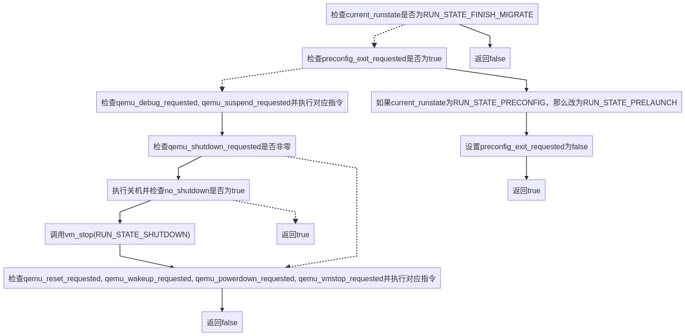

## vl.c中的主循环

#### 主循环前的初始化：`qemu_main_loop_init`

在主循环中，主要执行了：

+ `init_clocks`: 初始化`qemu_clocks`，还有一个汇编函数`prctl`不是很清楚有什么用

+ `qemu_signal_init`: 初始化描述符`fd`，`fd`描述符notify的信号有：
  
  + `SIGIO`: 产生IO事件
  + `SIGALRM`: alarm定时器被触发
  + `SIGBUS`: BUS类型的内存错误 
  
  本线程响应的信号集合为`tfd|fd|SIG_IPI`(`tfd`: 本线程原本响应的信号集合，`SIG_IPI`: 核间中断)
  
  `sigfd_handler`响应的信号为`fd`。
  
  如果定义了`CONFIG_SIGNALFD`那么还会为`sigfd_handler`的`fd`添加`FD_CLOEXEC`，这样当`qemu`线程`exec`时，该`fd`不会被传递到其他线程。
  
  `sigfd_handler`的`fd`总是会被添加`O_NONBLOCK`属性。
  
+ 创建`qemu_aio_context`，QEMU的`AioContext`继承了`GSource`，该上下文对象被用于异步操作，详细关于QEMU的`AioContext`的文章以后会专门写一篇。

+ 通过`qemu_bh_new`创建`qemu_notify_bh`: `bh`即`Bottom Half`，这里这个callback什么都没做，具体有什么用待考究。

+ 初始化`gpollfds`: 这是个`GArray`

这里面最重要的是创建了`qemu_aio_context`，注意它继承了`GSource`，因此将使用`glib2`的主事件循环完成`main_loop`的功能。

#### 事件驱动的主循环

主循环函数`main_loop`的源码如下：

```c
static void main_loop(void)
{
#ifdef CONFIG_PROFILER
    int64_t ti;
#endif
    while (!main_loop_should_exit()) {
#ifdef CONFIG_PROFILER
        ti = profile_getclock();
#endif
        main_loop_wait(false);
#ifdef CONFIG_PROFILER
        dev_time += profile_getclock() - ti;
#endif
    }
}
```

很明显，如果配置了`CONFIG_PROFILER`选项，那么`main_loop`会增加`profile`的代码，现在如果我们不打开这个选项，可以看得更清楚一些。

```c
static void main_loop(void)
{
    while (!main_loop_should_exit()) {
        main_loop_wait(false);
    }
}
```

这样就只剩下两个函数了。当条件函数`main_loop_should_exit`返回真时，循环中止，否则重复执行`main_loop_wait(false)`。

<!--
	#### `main_loop_should_exit`和`main_loop_wait`中的变量
​    `main_loop_should_exit`中的局部变量有: 
    + `RunState`:  `r`
    + `ShutdownCause`: `request`
    `main_loop_wait`中的局部变量有：
    + `MainLoopPoll`: `mlpoll`
    + `int`: `ret`
    + `int64_t`: `timeout_ns`
-->

#### `main_loop_should_exit`的逻辑

该函数实际是组合多个函数，任意一个函数仍需要继续保持循环，都会导致`main_loop_should_exit`返回`false`。

与其相关的一些比较重要的全局变量有

+ `RunState`: `current_run_state`, 初始为`RUN_STATE_PRECONFIG`

+ `bool`: `preconfig_exit_requested`，初始为`true`
+ `int`: `debug_requested`
+ `int`: `suspend_requested`
+ `int`: `powerdown_requested`
+ `ShutdownCause`: `shutdown_requested`
+ `ShutdownCause`: `reset_requested`
+ `RunState`: `vmstop_requested`，初始为`RUN_STATE__MAX`

我将之总结为下面的流程图：



首先分析`should_exit `什么时候会返回true，根据流程图，我们发现只有`preconfig_exit_requested`和`no_shutdown`会导致返回true，具体是什么我没有追究，顾名思义：如果我们提前设置请求退出程序或者虚拟机已经关机，就退出主循环。其他情况下都是处理有限个事件以后返回false。

#### `main_loop_wait`的逻辑

利用了`glib`的主事件循环，对每个`main_loop_poll_notifiers`中的事件获取更新的情况。

#### `main_loop`处理的事件

根据响应条件对他们分类：

+ `runstate_check(RUN_STATE_FINISH_MIGRATE)`
+ `preconfig_exit_requested`
+ `qemu_debug_requested()`
+ `qemu_suspend_requested()`
+ `qemu_shutdown_requested()`
+ `qemu_reset_requested()`
+ `qemu_wakeup_requested()`
+ `qemu_powerdown_requested()`
+ `qemu_vmstop_requested(&r)`

