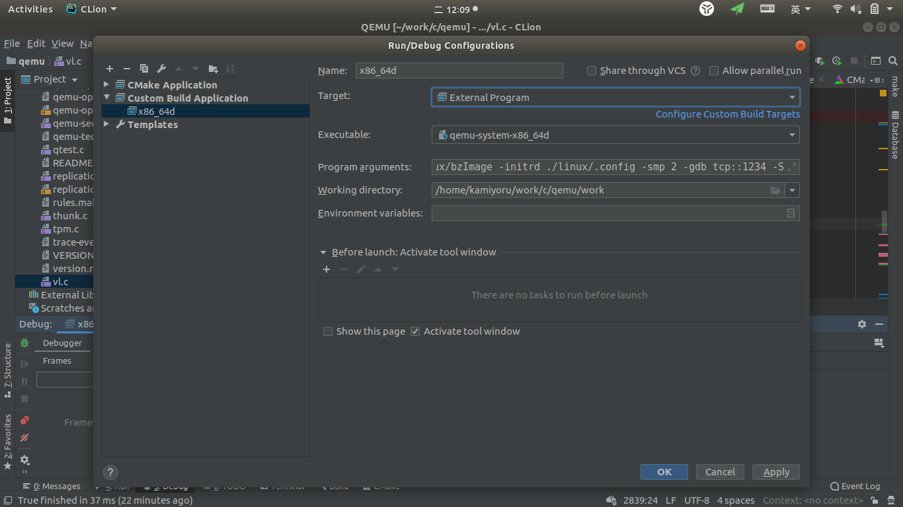

## ubuntu下配置QEMU相关的Clion环境

### Clion中添加Makefile编译信息

#### step1 生成Makefile

使用`configure`在`build`目录下生成Makefile

#### step2 安装Compilation Database

```bash
kamiyoru@kamiya:~/work/c/qemu$ sudo -H pip3 install compiledb
```

#### step3 编译和加载Compilation info

参考[compilation database](https://www.jetbrains.com/help/clion/compilation-database.html)

```bash
kamiyoru@kamiya:~/work/c/qemu$ cd build
kamiyoru@kamiya:~/work/c/qemu/build$ sudo compiledb -nf make
/bin/sh: 1: SRC_PATH: not found
/bin/sh: 1: BUILD_DIR: not found
ar: creating /home/kamiyoru/work/c/qemu/build/capstone/libcapstone.a
ar: creating /home/kamiyoru/work/c/qemu/build/capstone/libcapstone.a
ar: creating /home/kamiyoru/work/c/qemu/build/capstone/libcapstone.a
kamiyoru@kamiya:~/work/c/qemu/build$ mv compile_commands.json ..
```

因为qemu的`Makefile`入口不止一个，所以需要为每个`Makefile`都执行这个操作，我除了主`Makefile`，还添加了`x86_64-softmmu`的`Makefile`。这里提供一个`python`脚本供合并两个`compile_commands.json`

```python
#!/usr/bin/python3

import json

def load(x):
    with open(x) as f:
        a = json.load(f)
    return a

with open("./compile_commands.json", 'w+') as f:
    json.dump(load("./compile_commands-main.json") + load("./compile_commands-sub.json"), f)
```

打开Clion，选择`File > Open...`，加载`compile_commands.json`并选择加载为项目(Project)

#### 完成

静待索引建立完成，现在我们可以在Clion中审查代码了。

### Clion中Debug已编译的目标文件

#### step1 添加自定义target

这里我们利用`/bin/true`的特点捏造一个假的target。

`Settings > Build, Execution, Deployment > Custom Build Targets`中添加一项，name随便填，我填的是`External Program`，`build`自建一个，`Tool Settings > Program`填`/bin/true`。

#### step2 添加Configuration

添加`Run/Debug Configuration`，选择`Custom Build Application`

`Target`选step 1中的`External Program`，`Executable`选`qemu`编译好的文件，例如`qemu-system-x86_64d`。



#### step3 完成

添加断点，点击`Debug`(或`shift + F9`)，现在程序会停在`IDE`的指定位置

